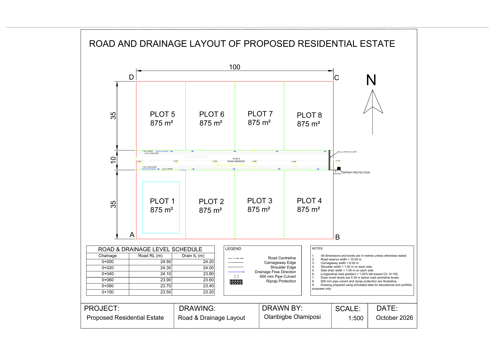

# Residential Estate Road & Drainage Layout — AutoCAD

## Project Overview

This project presents a simulated road and drainage layout for a proposed residential estate, developed in AutoCAD.

The project demonstrates the preparation of a 100 m internal road corridor with carriageway, shoulders, side drains, chainages, road levels, drain invert levels, drainage flow direction, a pipe culvert, outfall, and riprap protection.

The final drawing was prepared as an A3 technical sheet for portfolio presentation.

---

## Final Drawing

---

## Project Details

- **Software:** AutoCAD
- **Drawing Type:** Road & Drainage Layout
- **Road Length:** 100 m
- **Road Reserve Width:** 10.00 m
- **Carriageway Width:** 6.00 m
- **Shoulder Width:** 1.00 m each side
- **Side Drain Width:** 1.00 m each side
- **Longitudinal Gradient:** 1.00%
- **Culvert:** 600 mm Ø pipe culvert
- **Drawing Scale:** 1:500

---

## Chainage and Level Schedule

| Chainage | Road RL (m) | Drain IL (m) |
|---|---:|---:|
| 0+000 | 24.50 | 24.20 |
| 0+020 | 24.30 | 24.00 |
| 0+040 | 24.10 | 23.80 |
| 0+060 | 23.90 | 23.60 |
| 0+080 | 23.70 | 23.40 |
| 0+100 | 23.50 | 23.20 |

---

## Road Cross-Section

The 10 m road reserve consists of:

- 1.00 m side drain
- 1.00 m shoulder
- 6.00 m carriageway
- 1.00 m shoulder
- 1.00 m side drain

Total width:

**1 + 1 + 6 + 1 + 1 = 10 m**

---

## Drainage Design

The drainage system follows the longitudinal fall of the road toward chainage **0+100**.

Drain invert levels were set approximately **0.30 m below the road centreline levels**.

Drainage flow is directed toward the eastern end of the road, where water passes through a simulated **600 mm diameter pipe culvert** to an outfall protected with riprap.

The drainage and culvert dimensions are illustrative and were created for portfolio and educational purposes.

---

## Workflow

1. Reused the residential estate layout as project context.
2. Created separate layers for road centreline, carriageway, shoulders, drains, chainages, levels, culvert, and flow arrows.
3. Created a 100 m road centreline.
4. Offset the centreline to form the 6 m carriageway.
5. Added 1 m shoulders on both sides.
6. Added 1 m side drains within the 10 m road reserve.
7. Added chainages at 20 m intervals.
8. Assigned simulated road reduced levels.
9. Assigned drain invert levels.
10. Added drainage-flow arrows.
11. Added a 600 mm pipe culvert at the downstream end.
12. Added an outfall and riprap protection.
13. Prepared the final technical sheet in Paper Space.
14. Added schedules, notes, legend, and title block.
15. Prepared the drawing for PDF and portfolio export.

---

## AutoCAD Features Used

- LINE
- OFFSET
- TRIM
- POLYLINE
- Object Snap
- Layers
- MTEXT
- MLEADER
- Dimensions
- Hatch
- Tables
- Paper Space
- Viewports
- Plotting
- Linetypes
- Lineweights

---

## Skills Demonstrated

- AutoCAD 2D drafting
- Road layout drafting
- Drainage layout drafting
- Chainage annotation
- Reduced-level interpretation
- Drain invert levels
- Longitudinal gradient representation
- Culvert and outfall detailing
- Estate infrastructure drafting
- Layer management
- Technical annotation
- Paper Space layout
- Technical drawing presentation

---

## Project Files

This repository contains:

- `Residential_Estate_Road_Drainage_Layout.dwg` — editable AutoCAD drawing
- `Residential_Estate_Road_Drainage_Layout_Final.pdf` — final technical drawing
- `Residential_Estate_Road_Drainage_Layout_Preview.png` — portfolio preview image

---

## Key Learning Outcomes

This project improved my understanding of how road and drainage information can be represented in a technical AutoCAD drawing.

I also developed practical experience with chainages, road levels, drain invert levels, drainage-flow direction, culvert representation, and infrastructure drawing presentation.

---

## Disclaimer

This project was created using simulated data for educational and portfolio purposes.

The road gradient, drain levels, culvert size, and outfall arrangement are illustrative only and should not be interpreted as a construction-ready engineering design.

---

## Author

**Olaribigbe Olamiposi**

Surveying & Geo-Informatics  
AutoCAD | GIS | Geospatial Analysis
